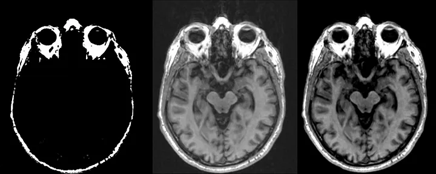
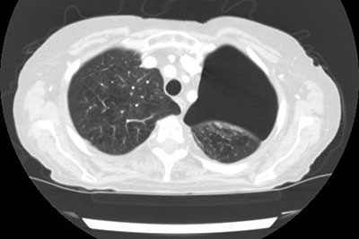
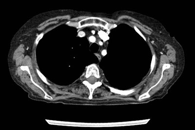

# Windowing

**Windowing**, also known as *grey-level mapping*, *contrast stretching*, *histogram modification* or *contrast enhancement* is the process in which the CT image greyscale component of an image is manipulated via the **CT numbers**; doing this will change the appearance of the picture to highlight particular structures. 

The **brightness** of the image is adjusted via the **window level**. 

The **contrast** is adjusted via the **window width**.

## Typical window width and level values

Although this varies somewhat from institution to institution and vendor to vendor, window width and centers are generally fairly similar. 

The values below are written as width and level (W:x L:y) in Hounsfield units (HU).

#### head and neck
- brain W:80 L:40
- subdural W:130-300 L:50-100
- stroke W:8 L:32 or W:40 L:40 3
- temporal bones W:2800 L:600
- soft tissues: W:350–400 L:20–60 4
#### chest
- lungs W:1500 L:-600
- mediastinum W:350 L:50
#### abdomen
- soft tissues W:400 L:50
- liver W:150 L:30
#### spine
- soft tissues W:250 L:50
- bone W:1800 L:400

---

     
                                                                                                 
Level: −200 HU; Width: 2000 HU (Range: −1200 to +800)

---

Level: +50 HU; Width: 350 HU (Range: −125 to +225)

---

Level: 300 HU; Width: 2000 HU (Range: −700 to +1300)

---
---
